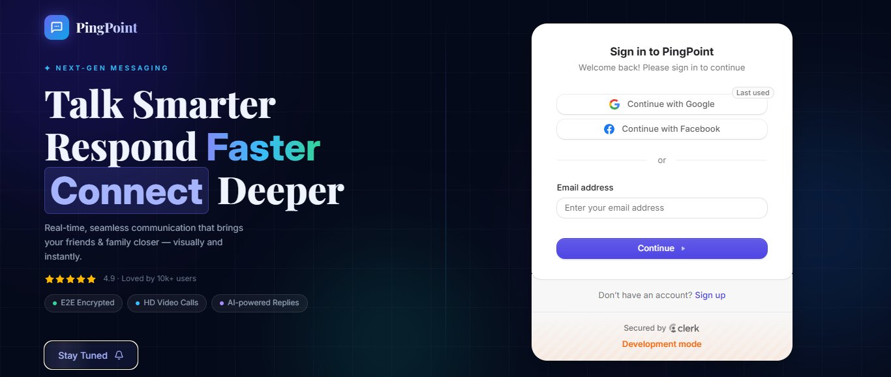

# 💬 PingPoint - Real-Time Chat Application

> **A full-stack next-gen messaging app** - built with React, Node.js, and real-time communication.  
> Instant messaging. Media sharing. Google & Facebook OAuth. 

[](https://chat-app-nine-dusky-33.vercel.app)
[](https://github.com/nikitatale/pingpoint-chat-app)
[](https://www.linkedin.com/in/nikita-tale)

---

## 🖼️ Demo Preview

 

---

## ✨ What Makes This Project Stand Out

| Feature | Description |
|---|---|
| ⚡ **Real-Time Messaging** | Send & receive messages instantly |
| 🔐 **OAuth Authentication** | Google & Facebook login via Clerk |
| 📸 **Media Sharing** | Upload & share images via ImageKit |
| 🗂️ **Redux State Management** | Efficient global state with Redux Toolkit |
| 🔔 **Real-Time Notifications** | Instant alerts via React Hot Toast |
| 📱 **Responsive UI** | Smooth experience across all devices |
| 📧 **Email Notifications** | Powered by Nodemailer |
| 🤖 **AI-Powered Replies** | Smart reply suggestions built in |

---

## 🛠️ Tech Stack

```
Frontend   → React, Vite, Redux Toolkit, TailwindCSS, React Router DOM
Backend    → Node.js, Express, MongoDB
Auth       → Clerk (Google + Facebook OAuth)
Media      → Multer + ImageKit
Email      → Nodemailer
Queue      → Inngest
Other      → Axios, Moment.js
Deployment → Vercel
```

---

## 📁 Project Structure

```
pingpoint-chat-app/
├── client/
│   ├── public/
│   ├── src/
│   │   ├── components/
│   │   └── pages/
│   ├── index.html
│   └── vite.config.js
├── server/
│   ├── configs/
│   ├── controllers/
│   ├── inngest/
│   ├── middlewares/
│   ├── models/
│   ├── routes/
│   ├── uploads/
│   └── server.js
```

---

## 🚀 Getting Started Locally

### Prerequisites
- Node.js v18+
- MongoDB Atlas account
- Clerk account
- ImageKit account

### Installation

```bash
git clone https://github.com/nikitatale/pingpoint-chat-app.git
cd pingpoint-chat-app
```

### Backend Setup
```bash
cd server
npm install
```

Create `.env` in `/server`:
```env
MONGO_URI=your_mongodb_url
CLERK_SECRET_KEY=your_clerk_secret
IMAGEKIT_PUBLIC_KEY=your_imagekit_public_key
IMAGEKIT_PRIVATE_KEY=your_imagekit_private_key
IMAGEKIT_URL_ENDPOINT=your_imagekit_url
```

```bash
npm run dev
```

### Frontend Setup
```bash
cd client
npm install
npm run dev
```

Visit → **http://localhost:5173**

---

## 💡 Key Learnings & Challenges

- Integrated **Clerk OAuth** — Google & Facebook login with secure session management
- Built **real-time messaging** with persistent MongoDB storage
- Managed **complex global state** with Redux Toolkit across chat rooms
- Implemented **Inngest** for background job queuing (email notifications)
- Set up **ImageKit pipeline** for optimized media uploads and delivery

---

## 👩‍💻 About the Developer

**Nikita Tale** - Full-Stack Developer specializing in MERN Stack  
Open to work! Let's connect →  
[](https://www.linkedin.com/in/nikita-tale)
[](https://github.com/nikitatale)

---

> ⭐ If you found this project interesting, please star it - it helps a lot!
